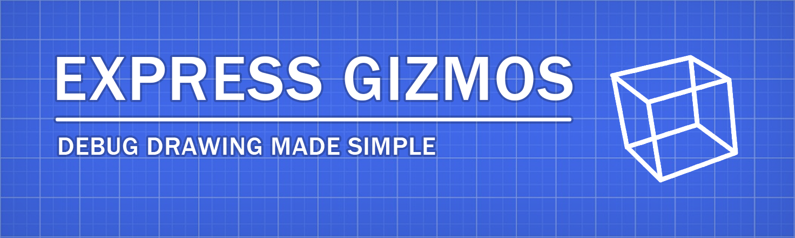
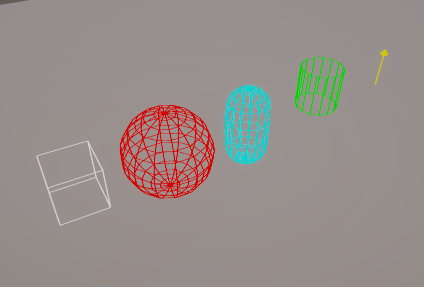

# Express Gizmos



A powerful and user-friendly Unity package for drawing debug gizmos in the editor, player, and build. This package simplifies the process of visualizing debug information in your Unity projects mimicking the capabilities of Unreal Engine's debug drawing functionality.

## Why Use This Package?

Unity's built-in gizmo drawing solution has limitations:

- Requires drawing shapes in specific methods like `OnDrawGizmos`
- Needs manual redrawing each frame for most shapes
- Limited to editor only

This package addresses these issues by providing:

- A static class for easy shape drawing from any part of your code
- Option to draw shapes for one frame or a specified duration
- Functionality that works in editor, player, and even in builds
- Improved visibility through a custom line rendering shader

## Supported Shapes

- Cube
- Sphere
- Capsule
- Cylinder
- Cone
- Disc
- Line
- Arrow

## Installation

### Via Unity Package Manager (UPM)

1. Open UPM (Unity Package Manager)
2. Click on the + icon in the top left corner of the UPM window and select "Add package from git URL..."
3. Enter the following URL: `https://github.com/normusF7/ExpressGizmos.git`

### Via Manifest

Add the following line to your `manifest.json` under `dependencies` in the `Packages` folder of your Unity project:

```json
"com.normusf7.expressgizmos": "https://github.com/normusF7/ExpressGizmos.git"
```

## Usage

1. Add `using ExpressGizmos;` to the top of your script file.
2. use static methods from `ExpressGizmos` class to draw shapes:

```csharp
ExpressGizmos.DrawCube(Vector3.zero, Vector3.one, Color.red, 5f);
ExpressGizmos.DrawSphere(new Vector3(2, 0, 0), 0.5f, Color.blue);
ExpressGizmos.DrawArrow(Vector3.zero, Vector3.forward, 2, Color.green);
```

## Screenshots


